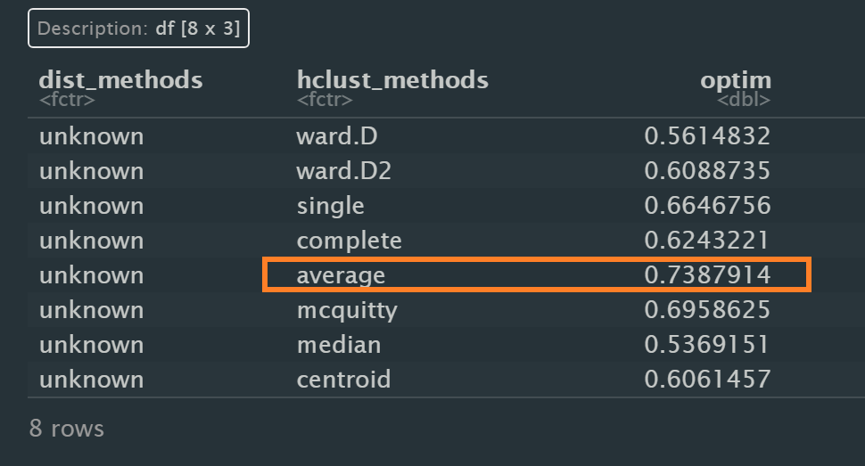

```{r setup, include=FALSE}
options(htmltools.dir.version = FALSE)
knitr::opts_chunk$set(
  fig.retina=3,
  cache = FALSE,
  echo = TRUE,
  message = FALSE, 
  warning = FALSE)
```

# 1. Overview

In this take-home exercise, the task will be to create a data visualisation to segment kid drinks and other by nutrition indicators. For the purpose of this task, *starbucks_drink.csv* will be used.

# 2. Proposed Design

After observering the data set, because we don't need to consider the relationship between different nutrition indicators, therefore I will use the heatmap to visualize the correspongding level of different nutrition indicators in different types of drinks which includes in the segment kid drinks and other.

Heatmaps visualise data through variations in colouring. When applied to a tabular format, heatmaps are useful for cross-examining multivariate data, through placing variables in the columns and observation (or records) in rowa and colouring the cells within the table. Heatmaps are good for showing variance across multiple variables, revealing any patterns, displaying whether any variables are similar to each other, and for detecting if any correlations exist in-between them.

# 3. Installing and loading the required libraries

Before we get started, it is important for us to ensure that the required R packages have been installed. For the purpose of the exercise, the follow packages will be used:

+ [seriation](https://cran.r-project.org/web/packages/seriation/index.html) package will be used to arrange all objects in a set in a linear order given available data and some loss or merit function in order to
reveal structural information.
+ [dendextend](https://cran.r-project.org/web/packages/dendextend/index.html) package will be used to visually and statistically compare different dendrograms to one another
+ [heatmaply](https://cran.r-project.org/web/packages/heatmaply/index.html) package will be used to make interactive cluster heat maps Using ‘plotly'.
+ [tidyverse](https://www.tidyverse.org/) package will be used to       by using the principle of [Layered Grammar of Graphs](https://vita.had.co.nz/papers/layered-grammar.html)

```{r}
packages = c('seriation', 'dendextend', 'heatmaply', 'tidyverse')

for(p in packages){library
  if(!require(p, character.only = T)){
    install.packages(p)
  }
  library(p, character.only = T)
}
```

# 4. Data Import 

The code chunk below imports *starbucks_drink.csv* into R environment by using [read_csv()](https://readr.tidyverse.org/reference/read_delim.html) function of readr package in tidyverse family.

```{r}
sd <- read_csv("data/starbucks_drink.csv")
```

# 5. Data Wrangling

Because we only need the cat the category of “kids drinks and other”. So the following code chunk will be used to filter this category by *filter()* function.

```{r}
kids_sd <- sd %>%
  filter(Category == "kids-drinks-and-other")
```

After reviewing the data we have now, the *Caffeine(mg)* is classified as it is classified as a character rather than a numerical value instead which is wrong. Hence, I will use the following code chunk to convert it.

```{r}
kids_sd$`Caffeine(mg)` <- parse_number(kids_sd$`Caffeine(mg)`)
```

Next, there is some missing value which is NA in the column of “Milk”  and “Whipped Cream”. So it should be replace by “No Milk” and “No Whipped Cream” as following code chunk.

```{r}
kids_sd[is.na(kids_sd)] <- "NA"
```

```{r}
kids_sd$Milk[kids_sd$Milk == "NA"] <- "No Milk"
kids_sd$`Whipped Cream`[kids_sd$`Whipped Cream` == "NA"] <- "No Whipped Cream"
```

Then we check the missing value again to ensure that there is no missing value.

```{r}
table(is.na(kids_sd))
```

Besides, when go through the column value of Caffeine, there is an outlier which is 225mg and 24 fl oz whose size is short, it is not reasonable and might be a mistake. So it should be removed from data set.


In the data set, the *Name, Milk and Whipped Cream* are all chr and I decided to combine them as drink name using following code chunk.

```{r}
kids_sd$Name = paste(kids_sd$Name,kids_sd$Milk, kids_sd$`Whipped Cream`)
```

For the Portion (fl oz) will affect the level of nutritional indicators, I will use the nutritional indicators value divided by the Portion (fl oz) mean to solve this influence.

```{r}
kids_goruped <- kids_sd %>%
  group_by(`Name`) %>%
  summarise('Calories' = sum(`Calories`)/sum(`Portion(fl oz)`),
           'Calories from fat'  = sum(`Calories from fat`)/sum(`Portion(fl oz)`),
           'Total Fat(g)' = sum(`Total Fat(g)`)/sum(`Portion(fl oz)`),
           'Saturated fat(g)' = sum(`Saturated fat(g)`)/sum(`Portion(fl oz)`),
           'Trans fat(g)' = sum(`Trans fat(g)`)/sum(`Portion(fl oz)`),
           'Cholesterol(mg)' = sum(`Cholesterol(mg)`)/sum(`Portion(fl oz)`),
           'Sodium(mg)' = sum(`Sodium(mg)`)/sum(`Portion(fl oz)`),
           'Total Carbohydrate(g)' = sum(`Total Carbohydrate(g)`)/sum(`Portion(fl oz)`),
           'Dietary Fiber(g)' = sum(`Dietary Fiber(g)`)/sum(`Portion(fl oz)`),
           'Sugars(g)' = sum(`Sugars(g)`)/sum(`Portion(fl oz)`),
           'Protein(g)' = sum(`Protein(g)`)/sum(`Portion(fl oz)`),
           'Caffeine(mg)' = sum(`Caffeine(mg)`)/sum(`Portion(fl oz)`)) %>%
  ungroup()
```

After that, we need to set the drink names as the row number and convert to a data matrix to build a heat map as following code chunk.

```{r}
row.names(kids_goruped) <- kids_goruped$Name
kids_gp_matrix <- data.matrix(kids_goruped)
```

# 6. Heatmap visualization

In the first step, we need to find out the best clustering method and number of cluster using the *dend_expend()* and *find_k()* functions.

```{r}
kids_gp_mx <- dist(normalize(kids_gp_matrix[, -c(1)]), method = "euclidean")
dend_expend(kids_gp_mx)[[3]]
```


According to the result above, the ‘average’ method should be used hence it has the highest optimum value.

Then for the best number of clusters, the *find_k()* function will be used.

```{r}
kids_cluster <- hclust(kids_gp_mx, method = "average")
kids_k <- find_k(kids_cluster)
plot(kids_k)
```
As the graph above, the number of clusters should be 10, therefore the ‘average’ method and 10 clusters will be used to plot the heatmap as following.

```{r,fig.height=8,fig.width=20}
heatmaply(normalize(kids_gp_matrix[,-c(1)]),
          dist_method = "euclidean",
          hclust_method = "average",
          seriate = "none",
          k_row = 10,
          colors = Blues,
          margins = c(NA,70,60,NA),
          fontsize_row = 5,
          fontsize_col = 7,
          xlab = "Nutritional Indicators",
          ylab = "Drink Types",
          main = "Starbucks Kids and Other Drinks’ Segment \nBy Nutrition Indicators",
          Colv = NA ,
          grid_color = "white",
          grid_gap = 0.1
          )
```
# 7. Insights

+ According to the ploted heat map, we find that the ***Salted Caramel Hot Chocolate with whipped cream*** has the highest calories, total fat and high-level calories from fat, sodium, total carbohydrate, sugars which can lead to diabetes, obesity and hypertension, therefore it is not good for kids and the parents should avoid to buy this drink as much as possible. It has the most deep color among all other nutritional indicators. So this drink is the ***more unhealthy drink*** for kid.

+ Further observation, we see that the ***more recommended drink*** is the **steamed apple juice** with no milk and no whipped cream for it only has moderate sugars and total carbohydrate and very low calories.

+ For the **calories from fat and total fat**, we can see that they have exactly same color in two columns, and the darker blue is the drink with **Hot Chocolate** and **whipped cream**, the drink with those two nutritional indicators is not recommended to children for higher calories from fat and total fat which can also lead to diabetes, obesity.

+ For the **saturated fat**, those drinks with coconut milk and whole milk added more likely to have higher level of the **saturated fat**, so those type of drinks are not recommended to order.

+ For the **caffeine**, we find that those drinks with **Hot Chocolate** have higher level of caffeine which is addictive and unhealthy. According to the American Academy of Pediatrics, it recommends that caffeine consumption is not appropriate for children and adolescents and should be avoided. This recommendation is based on a clinical report released by American Academy of Pediatrics in 2011 with a review of 45 publications from 1994 to 2011 and includes inputs from various stakeholders (Pediatricians, Committee on nutrition, Canadian Pediatric Society, Centers for Disease Control & Prevention, Food and Drug Administration, Sports Medicine & Fitness committee, National Federations of High School Associations). For children age 12 and under, Health Canada recommends a maximum daily caffeine intake of no more than 2.5 milligrams per kilogram of body weight. So the parents should **avoid** to order those drinks with Hot Chocolate even though almost kids enjoy it.
 
# 8. Reference

[Building Heatmap with R](https://isss608-ay2021-22t2.netlify.app/hands-on_ex/hands-on_ex05/hands-on_ex05-heatmap)


